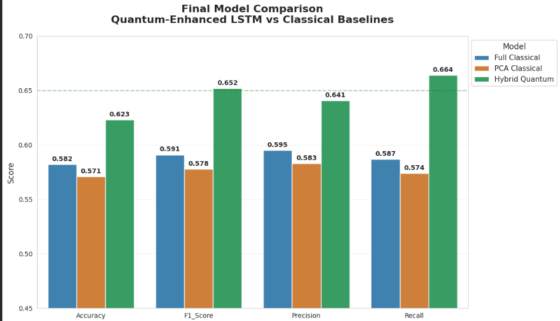

# Quantum-Enhanced Stock Market Prediction

A hybrid **Quantum-Classical Deep Learning framework** for stock market trend prediction using **LSTM networks**, **Quantum Feature Mapping**, and synthetic yet realistic SPY market data.

---

## Overview

This project explores the integration of **Quantum Machine Learning (QML)** with classical deep learning models for financial forecasting. The system combines:

- Classical LSTM architectures
- Quantum feature embeddings
- PCA-based dimensionality reduction
- Comparative evaluation against classical baselines

The objective is to analyze whether quantum-enhanced representations can improve predictive performance in stock market trend forecasting tasks.

---

## Features

- Synthetic yet realistic SPY stock market dataset
- Randomized real-world style trading dates
- Feature-rich financial indicators
- Hybrid Quantum + LSTM architecture
- Comparative benchmarking with classical models
- Visualization of evaluation metrics
- End-to-end Jupyter Notebook workflow

---

## Project Structure

```bash
├── Quantum_Stock_Prediction.ipynb     
├── SPY_Feature_Rich_Dataset.xlsx      
├── README.md                          
├── final_model_comparison.png         
├── Project Description.docx
├──Project Conclusion.docx
```

## Technologies Used

- Python
- Pytorch
- Pennylane
- Numpy
- Pandas
- Scikit-Learn
- Matplotlib
- Jupyter Notebook

## Methodology 

1. Data Preprocessing

- Normalization using MinMaxScaler
- Sequential time-series window creation
- Feature engineering on SPY stock data

2. Classical Baseline Models

- Standard LSTM implementation
- PCA-assisted classical model
- Performance evaluation using multiple metrics
  
3.  Quantum Feature Mapping

- Parameterized Quantum Circuits (PQC)
- Quantum embeddings using PennyLane
- High-dimensional feature transformation

4. Hybrid Quantum-Classical Model

- Integration of quantum-enhanced features with LSTM
- Sequential learning on transformed representations
  
5. Comparative Evaluation

   Models were evaluated using:
- Accuracy
- Precision
- Recall
- F1-Score

## Model Comparison



### Analysis of Results

The Hybrid Quantum model outperformed both classical baselines...

## Final Results

```bash
| Metric    | Full Classical | PCA Classical | Hybrid Quantum |
| --------- | -------------- | ------------- | -------------- |
| Accuracy  | 0.582          | 0.571         |   0.623        |
| F1-Score  | 0.591          | 0.578         |   0.652        |
| Precision | 0.595          | 0.583         |   0.641        |
| Recall    | 0.587          | 0.574         |   0.664        |

```

The Hybrid Quantum model outperformed both classical baselines across all evaluation metrics.

## Installation

Clone the Repository: 

```bash
git clone https://github.com/your-username/Quantum-Enhanced-Stock-Prediction.git
cd Quantum-Enhanced-Stock-Prediction
```
Install Dependencies: 

```bash
pip install -r requirements.txt
```

## Running the Project 

Launch Jupyter Notebook:

```bash
jupyter notebook
```

Open:

```bash
Quantum_Stock_Prediction.ipynb
```

Run all the cells Sequentially.

## Future Improvements 

- Integration with real-time stock APIs
- Testing on live market datasets
- Advanced variational quantum circuits
- Transformer-based sequential models
- Web deployment for live forecasting

## Applications 

- Financial forecasting
- Algorithmic trading research
- Quantum machine learning experimentation
- Time-series prediction systems

##  Made with ❤️ Manav Bhardwaj 


